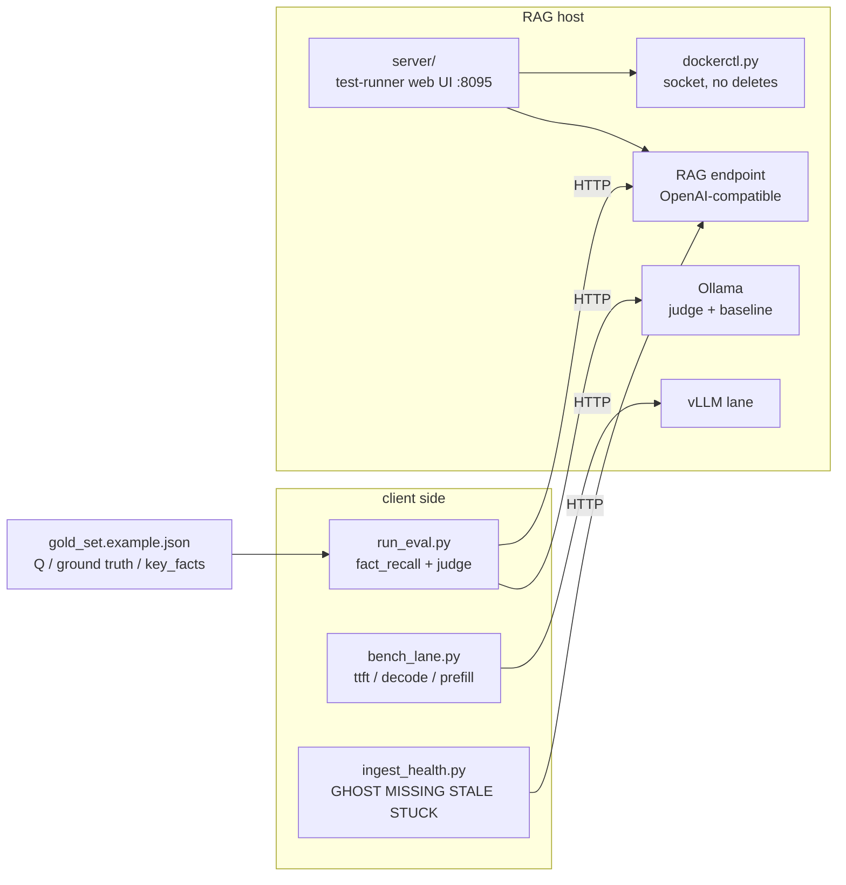

# rag-eval-harness

A stdlib-only eval harness for a self-hosted RAG stack: deterministic fact
scoring, an LLM judge that has to prove itself before it may grade, a
client-side lane benchmark that a prefix cache can't fool, a corpus health
checker, and a small web test-runner that swaps models without ever deleting
a container.

## The five eval runs I couldn't tell apart

Five runs inside seven minutes scored 0.615, 0.635, 0.635, 0.673 and 0.712,
and nothing on disk recorded which retrieval mode or corpus size each run
saw. Afterwards I couldn't split that spread into "config change" vs "corpus
change" vs "noise", and the highest number quietly became the quoted
baseline. Every run now pins `temperature: 0` and embeds a snapshot of the
corpus it actually measured (`corpus_state()`). A result that doesn't carry
its own inputs can't be compared to anything later.

## The file that was never indexed

The RAG had been answering infrastructure questions from a months-old
snapshot because one file never got indexed, and two more sat in
`processed/` with zero chunks. Ingestion had failed silently, and nothing
anywhere surfaced it. That's why `ingest_health.py` exists.

## How the pieces fit



## Quickstart

```bash
# point the harness at your stack (all defaults assume localhost)
cp examples/env.example .env   # edit, then export what you changed

# sanity-check the judge without scoring anything
python run_eval.py --self-test-only

# full eval against the bundled synthetic gold set
python run_eval.py

# deterministic scoring only (no judge model needed)
python run_eval.py --no-judge

# stopwatch-benchmark a lane
python bench_lane.py --base http://localhost:8010/v1 --model <your-model>

# corpus coverage report (exit 1 on problems, so it can drive a monitor)
python ingest_health.py
```

Write your own gold set by copying `gold_set.example.json`: each entry is
`{id, question, ground_truth, source, key_facts, notes?}` where `key_facts`
is a list of fact-slots, each slot a list of acceptable alternative strings.

The `server/` directory is a self-contained web test-runner (run
`python server/app.py` on the RAG host, since it needs the Docker socket)
with suites for latency, eval, and A/B model comparison.

## Design decisions, and why

The judge self-test is a gate, not a warning. Before any run that uses the
LLM judge, `run_eval.py` feeds it five known-right/known-wrong pairs. If the
judge misgrades any of them, the run aborts (exit 2) rather than emitting
numbers nobody should trust. A judge that can't tell an RTX 4090 from the
reference GPU has no business grading anything, and a printed warning above a
table of scores is a warning nobody reads.

Two scorers, and the deterministic one is the signal. `fact_recall` is a
substring/boundary match on `key_facts`; it can't hallucinate and it can't
drift between runs. `correctness` (the judge) is noisy in absolute terms and
gets used to compare runs, never to grade them. When the two disagree by more
than 0.5 on a question, the report flags it for human review, because usually
the `key_facts` list is wrong or the judge is being fooled.

`None` is not `0.0`. If the stack is down and nothing could be scored, the
summary's `fact_recall` is `None`, not zero. An outage must never look
identical to the stack answering every question wrong. One is an availability
problem, the other a quality collapse, and they have different owners and
different fixes.

Refusal count is a first-class metric. A refusal and a confident wrong answer
both score 0.00 on fact_recall, and that isn't a gap to close: a recall
metric structurally cannot represent the difference. The refusal count is the
only carrier of it. The worked case: one question used to be answered
"80,000 tokens" with total confidence and now refuses. Big improvement,
completely invisible in the headline number.

The prefill probe uses a unique gibberish prompt every run. vLLM's automatic
prefix caching once made a repeated-prompt probe report 53 ms "prefill" for
3.6k tokens, which was a cache hit, not prefill. `bench_lane.py` generates
random letter-strings per run so no prefix can ever be cached, and budgets
them at the measured ~2.6 tokens per gibberish word (vs ~1.3 for real
English). The real `prompt_tokens` still gets read back from the usage block
rather than trusted from the estimate, and a degenerate (fast-but-garbage)
answer is flagged so it can't inflate tok/s.

Corpus drift has a four-way taxonomy: GHOST / MISSING / STALE / STUCK. GHOST
(in `processed/` but zero chunks indexed, because ingestion failed silently)
bites hardest, since every other tool reports success. MISSING never got
ingested. STALE was edited after indexing, so the RAG serves the old text.
STUCK sits in `pending/` or `error/`. The tool never deletes and never
auto-re-uploads STALE files: the ingestion pipeline this was built against
duplicated chunks on re-ingest instead of replacing them, so "fixing"
staleness automatically would corrupt the corpus. Report loudly, repair
deliberately.

`dockerctl.py` has no delete endpoint, on purpose. Model swaps mean
recreating a container with new env, and the obvious implementation
(`rm` + `create`) has no undo. Instead, `restart_with_env` renames the live
container aside as `{name}-old-<timestamp>` before stopping it, creates the
replacement, and if create/start fails, shoves the broken newcomer to
`{name}-broken-<ts>`, renames the original back, and restarts it. Every step
of the rollback is a rename; nothing is ever destroyed. Stale parked
containers accumulate stopped and harmless. Also load-bearing: the raw-socket
HTTP client sends `Connection: close`, because the reader drains until the
peer closes and Docker's default keep-alive would otherwise block `recv`
until timeout.

`server/scoring.py` is a verbatim port of `run_eval.py`'s scorer, by design.
Its header says so and demands that any change be mirrored and re-baselined.
Two scorers that drift apart make the web runner's numbers and the CLI's
numbers silently incomparable, which is worse than the duplication. I took
the duplication with my eyes open.

Readiness gates around every swap. The test-runner never lets a cold model
load get absorbed into a scored latency: after any mode toggle or model swap,
one throwaway warm-up query has to return 200 before scoring starts. The
prior lane mode and model are always restored afterwards, with model restore
and mode restore as independent recoveries, so one failing can't suppress the
other.

## Limitations

- `key_facts` matching is string-level. Facts that can be paraphrased
  numerically ("2:30 AM" vs "02:30") need their alternatives spelled out.
- The judge is a small local model; treat `correctness` as a trend line
  between runs on the same judge, never as an absolute grade.
- `ingest_health.py` assumes a rag-uploader-style API (`/api/indexed`,
  `/api/files`, `/api/upload`); other pipelines need those three endpoints
  shimmed.
- The `server/` runner assumes an Ollama + vLLM lane split sharing one GPU
  and talks to the Docker socket directly, so it must run on the host, and
  its mode toggle is specific to that "only one engine may own the GPU"
  shape.
- One run at a time by design (a global run lock). This is a lab bench, not a
  CI farm.

## License

MIT. See [LICENSE](LICENSE).
